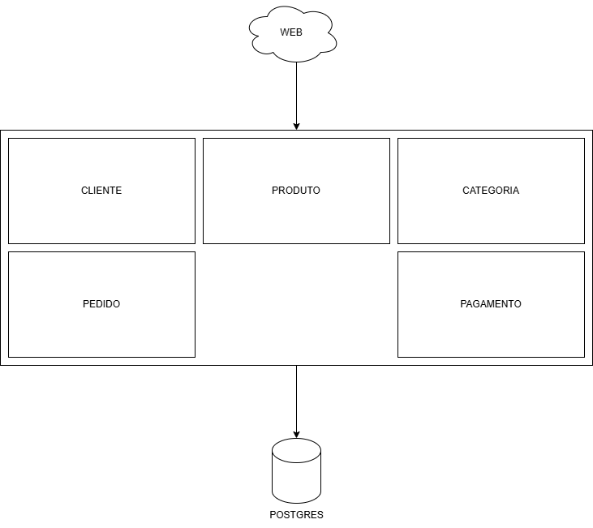
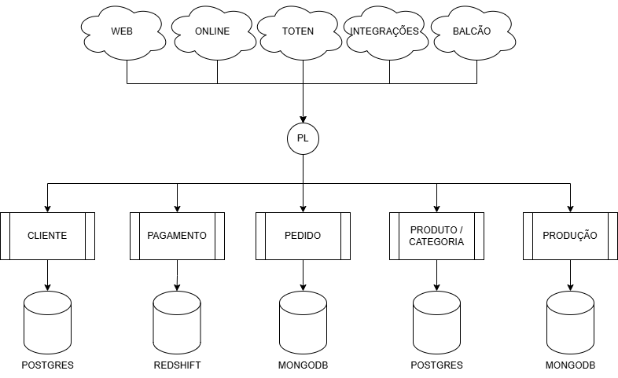
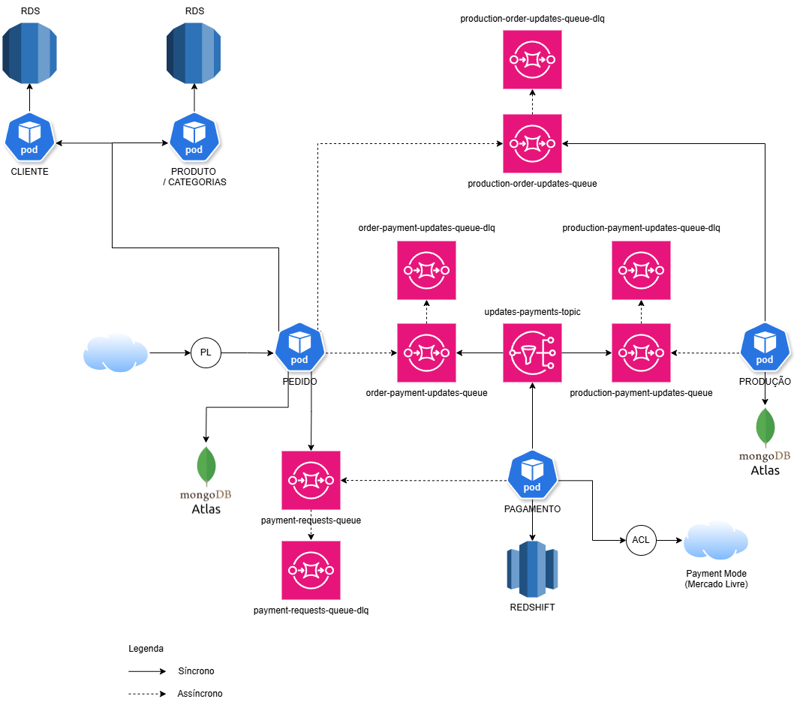
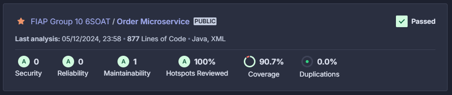

# PosTech - Arquitetura de Software - FIAP


# Documentação - Tech Challenge - Grupo 10 6SOAT
Repositório para o desafio do Tech Challenge da Pós-gradução em Software Architecture pela FIAP.

## Introdução
Uma lanchonete de bairro que está expandido sua operação devido seu grande sucesso. Porém, com a expansão e sem um sistema de controle de pedidos, o atendimento aos clientes pode ser caótico e confuso.
Para solucionar o problema, a lanchonete irá investir em um sistema de autoatendimento de fast food, que é composto por uma série de dispositivos e interfaces que permitem aos clientes selecionar e fazer pedidos sem precisar interagir com um atendente.

## Índice
<a name="membros"></a>
1. [Membros do Grupo](#membro)
   <a name="documentacoes"></a>
2. [Documentação do Projeto com Event Storming](#documentacao)
   <a name="arquitetura"></a>
3. [Arquitetura do Projeto](#arquitetura)
   <a name="requisitos"></a>
4. [Requisitos para Execução](#requisito)
   <a name="local"></a>
5. [Execução do projeto localmente](#execucao-local)
   <a name="docker"></a>
6. [Execução do projeto pelo Docker](#execucao-docker)
   <a name="rotas"></a>
7. [Rotas da API](#rota)
   <a name="ordens"></a>
8. [Ordem de Execução das API](#ordem)
   <a name="recursos"></a>
9. [Recursos](#recurso)
   <a name="erros"></a>
10. [Códigos de Erro](#erro)

<a id="membro"></a>
## Membros do Grupo
- [Anderson Oliveira](https://github.com/anderson-solucoes)
- [Gabriel Fonte](https://github.com/sourceGabriel)
- [Gabriel Marcelino](https://github.com/GabsMarcelino)
- [Rafael Moura](https://github.com/magneon)
- [Thiago Getnerski](https://github.com/Getnerski)

## Apresentação do Projeto


### [Vídeo da Fase 2](https://www.youtube.com/watch?v=y4m8ueFRydw)
### [Vídeo da Fase 3](https://www.youtube.com/watch?v=WleicW8Sx58)
### [Vídeo da Fase 4](https://www.youtube.com/watch?v=WleicW8Sx58)


<a id="documentacao"></a>
## Documentação do Projeto com Event Storming
Fizemos o mapeamento do fluxo de forma evolutiva, pensando a partir dos eventos passados, incrementando com os pontos de atenção para na sequência adicionar os comandos, modelos de leitura, políticas e sistemas externos, conforme o que foi aprendido em aula.

[Event Storming](https://miro.com/app/board/uXjVKVpAtxk=/?moveToWidget=3458764589554562116&cot=14)

<a id="arquitetura"></a>
## Arquitetura do Projeto
Abaixo é possível verificar nossa arquitetura em UML.
* `infra/controllers`: Responsável por receber todas requisições externas para realizar alguma ação em uma das entidades.
* `application/domain`: Responsável por centralizar todas nossa entidades que vão ser utilizadas no sistema.
* `application/usecases`: Responsável por criar casos de uso que vão realizar alguma ação na entidade, seja criação/atualização/remoção.
* `application/gateways`: Responsável pela nossa camada de abstração que será implementada em `infra/gateways`.
* `infra/gateways`: Responsável pela implementação das nossas abstrações de `application/gateways`.
* `infra/persistence`: Responsável epal persistências dos dados na entidades do banco de dados.


Agora que vimos como funciona nossa arquitetura em UML, migramos ela para Kubernetes:

* `deployment-application`: Essa arquitetura fica responsável por nossa API.
    * `Service (Load Balancer)`: É um tipo de serviço que distribui o tráfego de rede para os pods que executam sua aplicação
    * `Deployment`: É um recurso que fornece a maneira mais comum de gerenciar a implantação e a escalabilidade de aplicações em containers.
    * `ConfigMap`: É um recurso utilizado para armazenar dados de configuração em formato de pares chave-valor, nele vamos guardar nossas credenciais de URL para o banco de dados.
    * `Pods`: Cada pod encapsula um ou mais contêineres (containers).

* `sts-postgres`: Essa arquitetura fica responsável por nosso banco de dados.
    * `Service (ClusterIP)`: É um recurso que define uma forma lógica de agrupar um conjunto de pods e prover uma forma consistente de acessá-los.
    * `StatefulSet`: É um recurso que gerencia a implantação e o dimensionamento de um conjunto de pods e fornece garantias sobre a ordem e a identidade desses pods.
    * `Secret`: É um recurso utilizado para armazenar e gerenciar informações sensíveis, como senhas, tokens OAuth, etc.
    * `Pods`: Cada pod encapsula um ou mais contêineres (containers).


#### Em Resumo
A arquitetura do sistema descrita envolve duas principais componentes: a aplicação de API e o banco de dados PostgreSQL.

* `Banco de dados`: Os serviços externos irão se comunicar com o nosso Service do tipo ClusterIP, que redirecionará as requisições para o nosso StatefulSet. O StatefulSet é responsável por gerenciar quatro réplicas, cada uma rodando uma instância do nosso banco de dados. O armazenamento persistente é gerenciado pelo PersistentVolume e pelo PersistentVolumeClaim, garantindo que os dados lidos e escritos estejam sempre disponíveis e consistentes.
* `Aplicação`: Quando uma requisição for feita ao nosso DNS, ela será direcionada ao nosso Service do tipo Load Balancer. Este, por sua vez, redirecionará a solicitação para o nosso Deployment, que gerencia quatro réplicas da nossa API, cada uma em um contêiner separado. Cada contêiner terá uma conexão direta com o ClusterIP do banco de dados, garantindo uma comunicação eficiente e segura entre a aplicação e o banco de dados.

## Arquitetura da Infraestrutura na Nuvem


## Atualização da Arquitetura
A princípio nosso sistema foi desenvolvido no formato monolito para atender aos requisitos porém utilizando arquitetura Hexagonal e posteriormente, Clean Architecture. Assim sendo, a nossa arquitetura estava assim:



Na fase 4, nos foi solicitada a divisão do nosso monolito em serviços menores com contextos delimitados bem definidos. Tão logo recebemos a demanda, planejamos a separação da seguinte forma:



Por fim fizemos a separação de responsabilidades por contextos delimitados bem definidos, criando assim a arquitetura em microserviços.



<a id="requisito"></a>
## Requisitos para Execução
1. [Docker](https://www.docker.com/)
2. [DBeaver](https://dbeaver.io/download/)
3. [Maven](https://maven.apache.org/)
4. [Postman](https://www.postman.com/downloads/) (opcional, pois há Swagger em /api/api-docs ou /api/swagger-ui.html)
5. [Ngrok](https://ngrok.com/download) (opcional, para testar o webhook)

Antes de iniciar, certifique-se de que sua máquina atenda aos seguintes requisitos:<br/>

**JDK 11 instalado:**<br/>
Certifique-se de ter o JDK 11 instalado em sua máquina.<br/>
Para verificar a versão do JDK instalada, execute o seguinte comando no terminal:
```bash
java -version
```

**Maven >= 3 instalado:**<br/>
Verifique se você tem o Maven instalado em sua máquina. Para verificar a versão do Maven instalada, execute o seguinte comando no terminal:
```bash
mvn -version
``` 

**Docker desktop instalado:**<br/>
Verifique se você tem o Docker instalado em sua máquina. Para verificar a versão do Docker instalada, execute o seguinte comando no terminal:
```bash
docker -v
``` 
Se o Docker não estiver instalado, faça o download e siga as instruções de instalação do site oficial do Docker ou de outra fonte confiável.<br/><br/>


**Clonando o projeto:**<br/>
Clone o repositório do projeto em seu ambiente local.<br/>
```bash
git clone https://github.com/FIAP-6SOAT-G10/tech-challenge.git
```

## Configuração e Execução do Ngrok

### Instalação do Ngrok
Baixe e instale o Ngrok a partir do site oficial.

### Autenticação
Após a instalação, autentique-se com seu token de autenticação:
```sh
ngrok authtoken <seu_token_de_autenticação>
```

Iniciar o Ngrok:  
Execute o Ngrok para expor sua aplicação local na porta 8080:
```sh 
ngrok http 8080
```

### Atualizar a Variável _mercadopago.notification_url_:

Copie a URL gerada pelo Ngrok (algo como https://<subdomínio>.ngrok.io) e atualize e crie a variável MP_NOTIFICATION_URL atribuindo à variável o valor do NGrok:
```MP_NOTIFICATION_URL=https://<subdomínio>.ngrok.io/api/payments/confirmation ```

### Funcionamento do Webhook de Notificações do Mercado Pago

### Recebimento de Notificações:

O Mercado Pago envia notificações para a URL configurada ```(MP_NOTIFICATION_URL)``` sempre que há uma atualização no status de um pagamento.

### Endpoint de Webhook:
O endpoint ```/api/payments/confirmation``` recebe essas notificações e processa as informações enviadas pelo Mercado Pago.

### Processamento da Notificação:

O controlador PaymentController lida com as notificações recebidas. Ele verifica a ação (action) e, se for payment.updated, consulta o status do pagamento e atualiza o status do pedido no sistema.

<a id="execucao-local"></a>
## Execução do projeto localmente

### Passo 1: Iniciar o Postgres
Na raiz do projeto, execute o seguinte comando para criar o container com o banco de dados Postgres:

```bash
docker run --name=postgres -p 5432:5432 -e POSTGRES_USER=tech -e POSTGRES_PASSWORD=tech_passwd -e POSTGRES_DB=payments -d postgres
```

### Passo 2: Compilar o projeto
Após a criação do container do Postgres, você deve realizar o build do projeto utilizando o Maven:
```bash
mvn clean install -DskipTests -Pdev -q
```

### Passo 3: Executar o projeto
Após a criação do container do Postgres, você pode iniciar o projeto.

```bash
mvn spring-boot:run
```

<a id="execucao-docker"></a>
## Execução do projeto pelo Docker

### Passo 1: Executar o Docker Compose
Na raiz do projeto, execute o seguinte comando para criar os containers com o banco de dados Postgres, e realizar o build da aplicação via Docker:
```bash
docker-compose up -d
```

### Documentação
A documentação da API pode ser acessada através do Swagger em: [http://localhost:8080/api/swagger-ui.html](`http://localhost:8080/api/swagger-ui.html`)

### Testes

#### Testes Unitários
Para executar os testes unitários, basta executar o comando abaixo:

`make unit-test`

#### Testes Integrados
`make integration-test`

#### Testes Sistêmicos
`make system-test`

### Observações
- O arquivo `application.yml` contém as configurações de conexão com o banco de dados. Caso seja necessário alterar a porta do banco de dados, basta alterar a propriedade `spring.datasource.url` no arquivo `application.yml`.
- Os testes integrados batem na fila do SQS, consequentemente elas precisam estar criadas e disponíveis para execução dos testes.
- Os testes sistêmicos batem no Mercado Pago, consequentemente precisa estar configurado para que a integração funcione corretamente.

<a id="rota"></a>
## Rotas da API
Abaixo está descrito todas as rotas fornecidas da aplicação, bem como seu objetivo e possíveis códigos de retorno:

### Rotas de Pagamento
- `POST /api/payments/:externalOrderId/checkout`: Realiza a solicitação de pagamento para o Mercado Pago
- `POST /api/payments/confirmation`: Recebe o estímulo de retorno do Mercado Pago informando se o pagamento foi realizado ou se continua pendente. Um ponto importante aqui é que, o Mercado Pago continua enviando notificações para o endpoint acima durante 15 minutos, após isso, a notificação é cancelada caso não receba um status code 200 dentro de 15 minutos.
- `GET /api/payments/:internalPaymentId`: Consulta dados do pagamento realizado.

<a id="ordem"></a>
## Ordem de Execução das API
Para o funcionamento correto das APIs, a ordem abaixo deverá ser seguida à depender do cenário desejado:

### Criar ordem de pagamento no Mercado Pago
<a name="recurso"></a>
1. [Pagamento](#recurso1)
2. [Confirmar pagamento](#recurso2)
3. [Consultar pagamento](#recurso3)

<a id="recurso"></a>
## Recursos

### Cliente

<a id="recurso1"></a>
#### Pagamento
```sh
POST http://localhost:8080/api/payments/:externalOrderId/checkout
```
<a id="recurso2"></a>
#### Confirmar pagamento
```sh
POST http://localhost:8080/api/payments/confirmation
{
  "resource": "12345678900"
  "topic": "merchant_order"
}
```

<a id="recurso3"></a>
#### Consultar pagamento
```sh
GET http://localhost:8080/api/payments/:internalPaymentId
```

<a id="erro"></a>
## Códigos de Erro
### Erros genéricos:
- `001`: Parâmetro obrigatório não foi enviado.
### Erros de categoria:
- `100`: Categoria inválida.
### Erros de produtos:
- `200`: O nome do produto é obrigatório.
- `201`: A descrição do produto é obrigatória.
- `202`: O preço do produto é obrigatório.
- `203`: A imagem do produto é obrigatória.
- `204`: Identificador de produto inválido.
- `205`: O identificador fornecido não está relacionado a nenhum produto existente.
- `206`: Erro durante a atualização do produto no banco de dados.
- `207`: Erro genérico ao atualizar o produto.
- `208`: A categoria do produto é obrigatória.
- `209`: Não existem produtos registrados para a categoria informada.
### Erros de clientes:
- `300`: CPF inválido.
- `301`: O cliente com o CPF informado já existe.
- `302`: O email do cliente é obrigatório.
- `303`: O CPF do cliente é obrigatório.
- `304`: O campo CPF é obrigatório ao atualizar um cliente.
- `305`: O nome do cliente é obrigatório.
### Erros de pedidos:
- `400`: O pedido informado não foi localizado.
- `401`: Erro durante a atualização do status do pedido no banco de dados.
- `402`: O identificador do pedido é inválido.
- `403`: O status à ser atualizado é obrigatório.
- `404`: Não é possível atualizar o pedido para o status informado.
- `405`: Pedidos no status 'Recebido' só podem avançar para o status 'Em preparação'.
- `406`: Pedidos no status 'Em preparação' só podem avançar para o status 'Pronto'.
- `407`: Pedidos no status 'Pronto' só podem avançar para o status 'Finalizado'.
- `408`: Pedidos no status 'Finalizado' não podem ser alterados.
- `499`: Erro genérico ao atualizar o status do pedido.

## Cobertura


### [Link para a Evidência de Cobertura](https://sonarcloud.io/project/overview?id=FIAP-6SOAT-G10_fiap-fast-food-ms-pedido)

[](https://sonarcloud.io/summary/new_code?id=FIAP-6SOAT-G10_fiap-fast-food-ms-pedido)